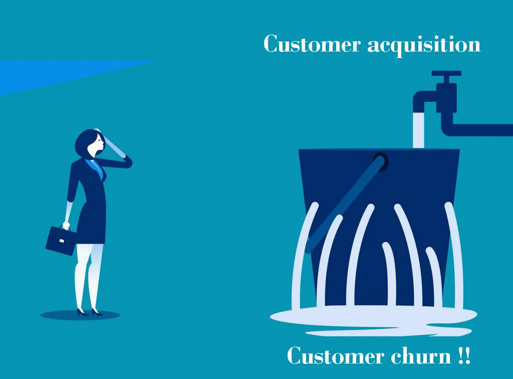
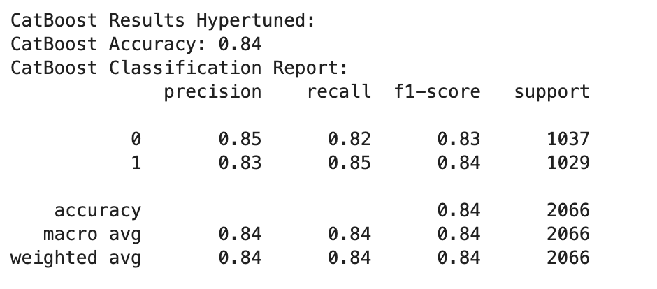
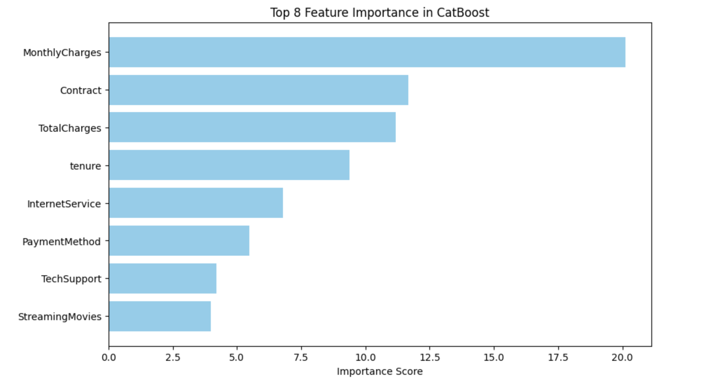

# Telco Churn Analysis And Prediction 

Credits: [Medium](https://medium.com/@adiaturb/customer-churn-prediction-with-python-end-to-end-machine-learning-project-93ccc6b2218f)

**Customer churn** is one of the most important metrics for a growing business to evaluate. It's easier to save an existing customer before they leave than to convice them to come back. Understanding and preventing customer churn is critical to company's **long-term success**.

In this project, we will use statistical testing to analyze the key factors of customers who are more likely to churn, develop a classification model to predict churn based on those factors, and provide recommendations for retaining customers as well as predictions of churn for a list of customers (delivered via csv).
## Business Goals
- Find drivers for customer churn at Telco. Why are customers churning?

- Construct a ML classification model that accurately predicts customer churn.

- Deliver a report that a non-data scientist can read through and understand what steps were taken, why and what was the outcome?

## Initial Questions
- Which variables are associated with churn?

- Are average monthly charges higher for customers who churn?

- Are tenure shorter for customer who churn?

- Are additional services independent with churn?
##   Data Dictionary

| **Variable**         | **Value**                                                                 | **Meaning**                                                                  |
|----------------------|---------------------------------------------------------------------------|------------------------------------------------------------------------------|
| `customerID`         | Unique identifier                                                         | A unique ID assigned to each customer                                        |
| `gender`             | 1) Male 2) Female                                                         | The customer's gender                                                        |
| `SeniorCitizen`      | 0 or 1                                                                    | Indicates if the customer is a senior citizen (1) or not (0)                 |
| `Partner`            | Yes or No                                                                 | Indicates if the customer has a partner                                      |
| `Dependents`         | Yes or No                                                                 | Indicates if the customer has dependents                                     |
| `tenure`             | Integer (0-72)                                                            | This shows how long (in months) the customer has stayed with the company     |
| `PhoneService`       | Yes or No                                                                 | Indicates if the customer has a phone service                                |
| `MultipleLines`      | 1) Yes 2) No 3) No phone service                                           | Indicates if the customer has multiple phone lines                           |
| `InternetService`    | 1) DSL 2) Fiber optic 3) No internet service                              | Indicates the type of internet service the customer has                      |
| `OnlineSecurity`     | 1) Yes 2) No 3) No internet service                                       | Indicates if the customer has online security service                        |
| `OnlineBackup`       | 1) Yes 2) No 3) No internet service                                       | Indicates if the customer has online backup service                          |
| `DeviceProtection`   | 1) Yes 2) No 3) No internet service                                       | Indicates if the customer has device protection service                      |
| `TechSupport`        | 1) Yes 2) No 3) No internet service                                       | Indicates if the customer has tech support service                           |
| `StreamingTV`        | 1) Yes 2) No 3) No internet service                                       | Indicates if the customer has streaming TV service                           |
| `StreamingMovies`    | 1) Yes 2) No 3) No internet service                                       | Indicates if the customer has streaming movies service                       |
| `Contract`           | 1) Month-to-month 2) One year 3) Two year                                 | Indicates the type of contract the customer has                              |
| `PaperlessBilling`   | Yes or No                                                                 | Indicates if the customer is using paperless billing                         |
| `PaymentMethod`      | 1) Bank transfer 2) Credit card 3) Electronic check 4) Mailed check        | Indicates the method the customer uses to pay for the service                |
| `MonthlyCharges`     | Float                                                                     | Indicates the amount the customer is charged each month                      |
| `TotalCharges`       | Float                                                                     | Total amount charged to the customer                                         |
| `Churn`              | Yes or No                                                                 | Indicates if the customer has churned (left the service)                     |

##  Process
#### 1. Data Acquisition

- Gather data from Kaggle  - [Telco Customer Churn](https://www.kaggle.com/datasets/blastchar/telco-customer-churn)

#### 2. Data Preparation

##### Data Cleaning

- Missing values: null values are dropped
- Data types: object is converted to the numeric datatype
- Duplicate columns: duplicated columns are dropped

#### 3. Exploratory Analysis
- Ask questions to find what are the key variables that are driving the churn

- Create visualizations for the churn rate for each variable

- Conduct T-Test for categorical variable vs. numerical variable

- Conduct Chi^2 Test for categorical variable vs. categorical variable

- Conclude hypothesis and address the initial questions

  - Hypothesis 1: Which categorical variables are associated with churn?
  - Hypothesis 2: Do customers who churn have higher average monthly charges than those who don't? 
  - Hypothesis 3: Does customers who churn has a shorter tenure on average than those who don't?

#### 4. Data Preprocessing
- Categorical data formated where necessary such as groups No service into No
- Checking for any other discrepancy
- Dropping Gender as it is 50 50 and won't be helpful
- SMOTE technique for imbalance dataset

#### 5.  Predicting Churn
- Create logistic regression, random forest, XgBoost, CatBoost and fit train dataset

- Find the best performing classifier (evaluated using classification report, accuracy score, F1)

- Pick the top model among all the models and evaluate performance on validate dataset and test dataset

- Cat boost performed the best 

#### 6.Tuning Model
- Top 8 feature selected using feature importance and evaluated
- The best model Catboost is hypertuned for best parameters
- Then the model with the highest accuracy and F1 score and make predictions and save it to a csv file

## 7. Key Findings

### Payment Method: Electronic Check

Observation: Customers using the electronic check payment method have a higher churn rate compared to other payment methods.

Insight: This may indicate dissatisfaction with the electronic payment process or issues related to payment reliability.

### Contract Type: Month-to-Month

Observation: Customers with a month-to-month contract exhibit a significantly higher churn rate.

Insight: Short-term contracts may suggest a lack of commitment or loyalty from customers, making them more prone to churn.

### Internet Service: Fiber Optic

Observation: Customers who use fiber optic internet service show a higher churn rate than those with other internet service types.

Insight: This could indicate issues with service delivery, pricing, or competition within the market for fiber optic services.

### Tech Support: No Tech Support

Observation: Customers who do not use tech support have a higher churn rate.

Insight: This may indicate that customers who require assistance or have technical issues are not receiving the support they need, prompting them to leave.

### Device Protection: No Device Protection

Observation: Customers without device protection services exhibit higher churn rates.

Insight: This could reflect customers' perceptions of the value of such services or dissatisfaction with coverage, leading them to discontinue their subscriptions.

### Online Security: No Online Security

Observation: Customers without online security services have a higher churn rate.

Insight: This suggests that customers who feel unprotected online may be more likely to leave, indicating a potential area for improving service offerings.
 
▪️ Average **monthly charges** is higher for customers who churn
 
▪️ Average **tenure** is shorter for customers who churn
 
▪️ Additional services (device protection, online security, online backup, tech support, streaming tv, streaming movies) are dependent on churn

▪️ The meachine learning model: logistic regression classifier is expected to predict churn with **81% accuracy** on future unseen data

## 8. Recommendations
#### 1. Identify At-Risk Customers Using Churn Prediction

Action: Utilize your churn prediction model to score the entire customer base and identify those at high risk of churn based on predictive probabilities.

Implementation: Segment customers into risk categories (low, medium, high) to tailor retention efforts.

#### 2. Address Key Drivers of Churn

- Payment Method: Electronic Check

Observation: Customers using electronic checks show a higher churn rate.

Recommendation: Investigate issues with the electronic payment process, and consider offering alternative payment methods or incentives for those switching to more reliable payment options.

- Contract Type: Month-to-Month

Observation: Month-to-month contracts correlate with higher churn rates.

Recommendation: Promote longer-term contracts through attractive discounts or benefits to enhance customer commitment and reduce churn likelihood.
- Internet Service: Fiber Optic

Observation: Customers using fiber optic internet services exhibit higher churn.

Recommendation: Enhance service reliability and address any performance issues. Consider bundling fiber optic services with additional perks (e.g., discounts on related services).

- Tech Support: No Tech Support

Observation: A lack of tech support correlates with higher churn.

Recommendation: Enhance customer support by offering dedicated tech support packages or proactive outreach to customers who haven’t utilized support services.

- Device Protection: No Device Protection

Observation: Higher churn rates among customers without device protection.

Recommendation: Communicate the value of device protection services through targeted campaigns, possibly offering limited-time promotions to entice sign-ups.

- Online Security: No Online Security

Observation: Customers without online security services are more likely to churn.

Recommendation: Educate customers on the importance of online security and offer promotional rates for those who sign up for security services.

#### 3. Implement Targeted Retention Campaigns

Action: Develop and execute tailored campaigns for at-risk customers, focusing on the insights derived from churn drivers.

Implementation:
Personalized Offers: Create customized offers based on specific churn drivers (e.g., discounts for customers using electronic checks or incentives for those switching to longer contracts).
Dedicated Outreach: Conduct targeted communications, emphasizing the improvements made in service reliability, tech support, and online security.

#### 4. Leverage Customer Insights for Engagement

Action: Use customer feedback to understand their needs and concerns, particularly regarding the identified churn drivers.

Implementation:
Feedback Mechanisms: Regularly solicit feedback from customers regarding their payment methods and service experiences.
Engagement Programs: Implement educational programs that enhance customers' understanding of the services they use and how to maximize their benefits.

#### 5. Monitor Engagement and Satisfaction

Action: Regularly track customer engagement and satisfaction levels, especially after targeted retention efforts.

Implementation:
Pulse Surveys: Conduct surveys focused on customers’ satisfaction with payment methods and service offerings.
Engagement Metrics: Analyze metrics to determine if retention strategies lead to increased engagement and reduced churn.

#### 6. Utilize Predictive Analytics for Proactive Adjustments

Action: Continuously update the churn prediction model and adjust strategies based on new insights and customer data.

Implementation:
Model Retraining: Regularly retrain the churn prediction model with the latest data for improved accuracy.
Outcome Tracking: Monitor churn rates before and after implementing retention strategies to evaluate effectiveness.

#### 7. Foster Cross-Functional Collaboration

Action: Encourage collaboration across departments to share insights and improve retention strategies.
Implementation:
Unified Approach: Ensure that marketing, sales, and customer service teams work together to create a cohesive retention strategy based on shared data insights.

##  Next Steps
▪️ Collect more data on customers' **demographic information** (eg. place of residence, socio-economic data such as occupation, household income.)

▪️ Develop machine learning models with higher accuracy with these additonal data and more accurate features.

▪️ Conduct **price discrimination analysis** to further determine the price point for each contract type and service.

## Conclusion
By combining the insights from the analysis of churn drivers with proactive retention strategies informed by churn prediction, you can effectively address the underlying issues leading to customer churn. This comprehensive approach will enhance customer satisfaction, loyalty, and ultimately lead to improved business outcomes.